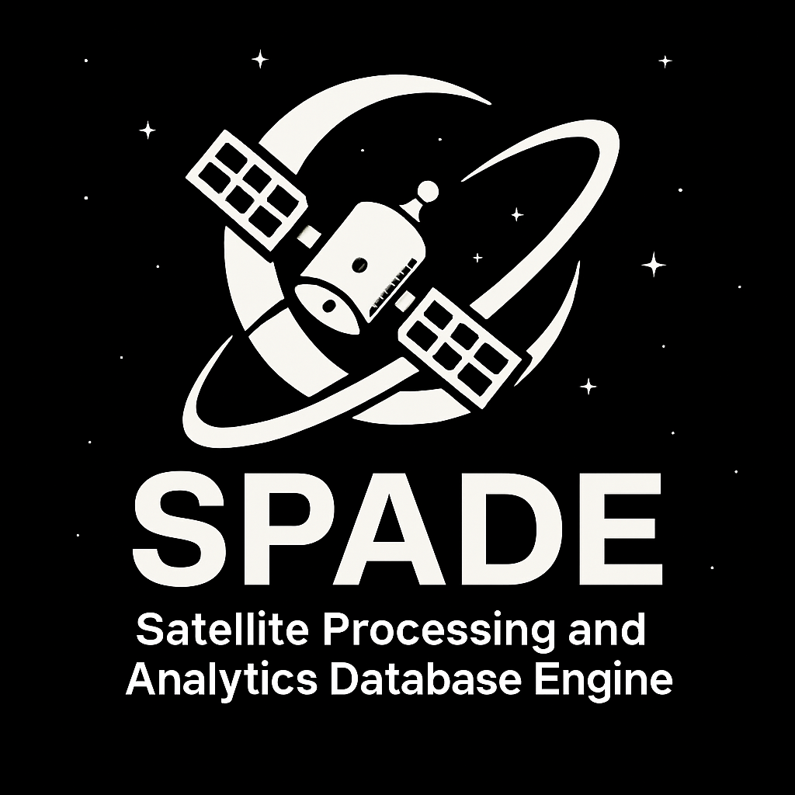

# To run

Before running, ensure you have set up your [Python virtual environment](#creating-a-python-virtual-environment) and [installed the necessary dependencies](#after-activation).

```bash
python main.py
```

# Command Line Interface (CLI) Options

The `main.py` script provides several command-line arguments to perform different operations:

- **`-r`, `--Refetch`**:
  This option triggers the data refetching process. When used, the program will:

  - Download the full satellite catalog from Space-Track, including general data for all currently tracked objects and debut information (when objects were first cataloged).
  - Download the full satellite catalog from ESA's DISCOS (Database and Information System Characterising Objects in Space).
  - Update the local database with the newly fetched information.
  - **Example**: `python main.py --Refetch`
  - **Note**: This command requires your API credentials to be configured in the `.env` file as described in the [Environment Setup](#environment-setup).

- **`-c`, `--Count`**:
  This option outputs basic statistics about the current satellite data stored in the database. It will display:

  - The total number of satellites for which dry mass data is available.
  - The total number of satellites that are currently being tracked.
  - The total number of satellites stored in the database.
  - **Example**: `python main.py --Count`

* **`-g`, `--Graph` [Graph_Type]**:
  This option allows you to generate various types of graphs based on the data in the database. You must specify one of the following graph types:
  - **`SatsOvertime`**: Generates a line graph showing the cumulative number of objects in orbit over time, categorized by type, with annotations for significant space events.
    - Output: `./rendered_graphs/Cumulative_Objects_in_Orbit_by_Type.png`
    - **Example**: `python main.py --Graph SatsOvertime`
  - **`scatterPlot`**: Creates a scatter plot visualizing the orbital altitude range (apoapsis and periapsis) for each satellite, showing the spread of objects at different altitudes.
    - Output: `./rendered_graphs/ScatterPlot.png`
    - **Example**: `python main.py --Graph scatterPlot`
  - **`scatterPlotAVG`**: Generates a scatter plot focused on the mean altitude of satellites, providing a single representative altitude point for each object.
    - Output: `./rendered_graphs/ScatterPlotAVG.png`
    - **Example**: `python main.py --Graph scatterPlotAVG`
  - **`scatterPlotGrid`**: Produces a 2x2 grid of scatter plots illustrating key satellite parameters: mean altitude, eccentricity, inclination, and dry mass.
    - Output: `./rendered_graphs/ScatterPlotGRID.png`
    - **Example**: `python main.py --Graph scatterPlotGrid`
  - **`scatterAltInc`**: Generates a scatter plot displaying the relationship between satellite mean altitude and inclination, with point size scaled by orbital density.
    - Output: `./rendered_graphs/ScatterALtInc.png`
    - **Example**: `python main.py --Graph scatterAltInc`
  - **`scatterDensityBins`**: Creates a line graph showing the spatial density of different object types (Payload, Debris, Rocket Body, Total) across 1km altitude bins on a logarithmic scale.
    - Output: `./rendered_graphs/DensityLineGraph.png`
    - **Example**: `python main.py --Graph scatterDensityBins`
  - **`3dorbits`**: Generates 3D visualizations of satellite orbits.
    - **Example**: `python main.py --Graph 3dorbits`

You can combine these options, for example, to refetch data and then generate a graph:

- **Example**: `python main.py --Refetch --Graph SatsOvertime`

# Creating a Python Virtual Environment

A virtual environment isolates your project's dependencies.

### macOS & Linux

1.  **Create the environment:**

    ```bash
    python3 -m venv venv
    ```

2.  **Activate the environment:**
    ```bash
    source venv/bin/activate
    ```
    _(Your terminal prompt will now show `(venv)`)_

### Windows

1.  **Create the environment:**

    ```powershell
    python -m venv venv
    ```

2.  **Activate the environment:**
    ```powershell
    .\venv\Scripts\activate
    ```
    _(Your terminal prompt will now show `(venv)`)_

---

### After Activation

You can now install packages, which will be isolated to this project (All packages are inside the virtual enviroment).

```bash
pip install -r requirements.txt
```

### Deactivating

When you are finished, simply run:

```bash
deactivate
```

# Environment Setup

This program is configured to retrieve API credentials from an `.env` file to fetch data from Space-Track and ESA DISCOS.

1.  **Copy the Example Environment File**:
    You need to create a file named `.env` in the root directory of the project, in the same location as `.env.example`.

    - On Linux/macOS, you can use the command:
      ```bash
      cp .env.example .env
      ```
    - On Windows, you should manually copy the `.env.example` file and rename it to `.env`.

2.  **Edit Your `.env` File**:
    Open the newly created `.env` file and replace the placeholder values with your actual credentials:

    ```ini
    # Below is how you should structure your own .env file. Please change example values to your own
    SPACE_TRACKER_USERNAME=email@gmail.com
    SPACE_TRACKER_PASSWORD=Password123!
    DISCOS_TOKEN=UIDNENONVN!@43sDJFSDKJFL # This is the token from ESA DISCOS
    ```

    - **`SPACE_TRACKER_USERNAME`** and **`SPACE_TRACKER_PASSWORD`**:
      These are your login credentials for Space-Track. If you do not have an account, you can register for free at the [Space-Track website](https://www.space-track.org/auth/login).

    - **`DISCOS_TOKEN`**:
      This is an API token required to access data from ESA's DISCOS. To obtain your DISCOS token:
      1.  Go to the [ESA DISCOS Portal](https://discosweb.esoc.esa.int/).
      2.  If you don't have an account, register. Otherwise, log in.
      3.  Navigate to your user profile at the top right of the portal, click the dropdown and select Access Tokens.
      4.  Look for an option to generate new token. Generate a new token and copy it into your `.env` file.
